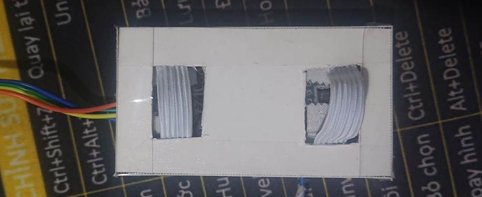

# TWO-POINT PPG MEASUREMENT DEVICE
The two-point PPG device helps estimate heart rate from PPG acquired at two points on the finger. The components of the device include the STM32F103C8T6 MCU and two MAX30102 PPG sensors.

There are two folders in the repo. `c/heartrate_est` contains the C code embedded on the STM32 MCU. `py` contains the Python code used to visualize the PPG signal and test the efficiency of the algorithm that will be implemented on the STM32 MCU.

